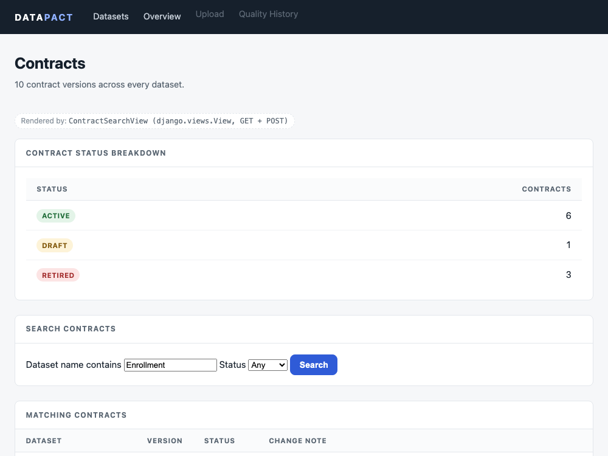
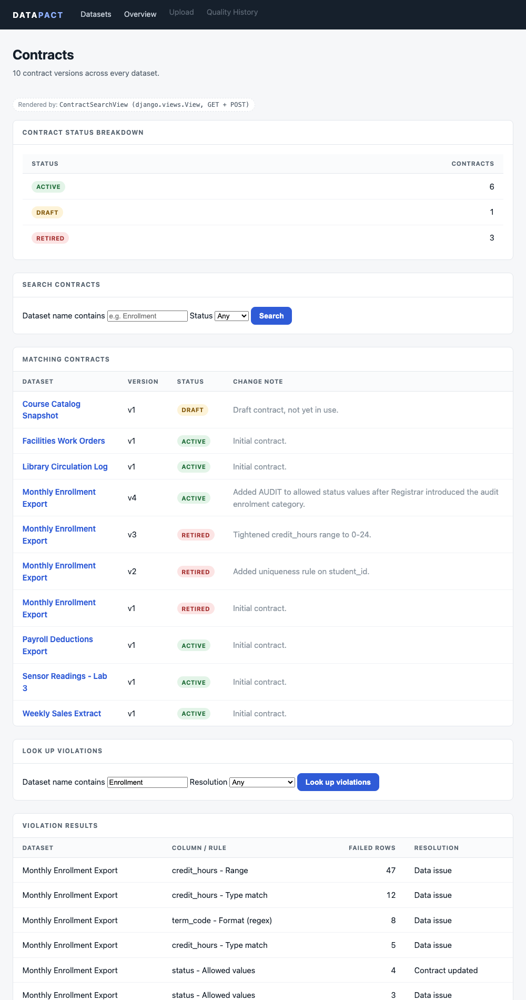
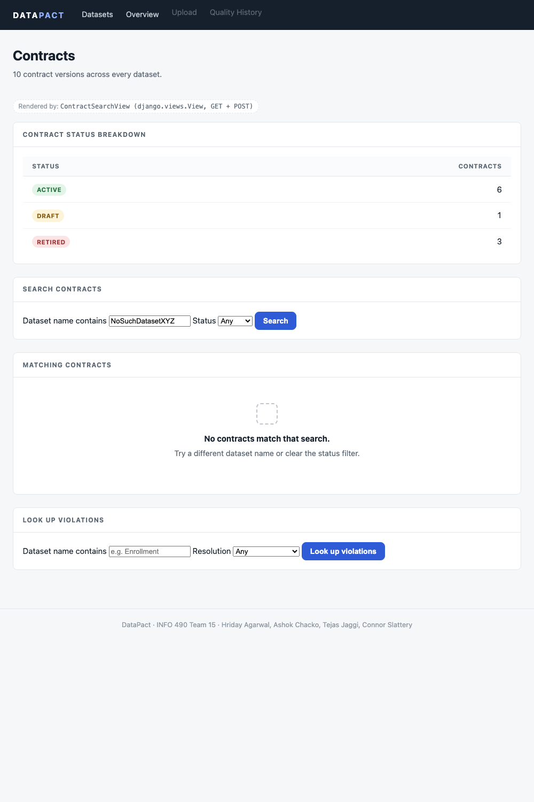
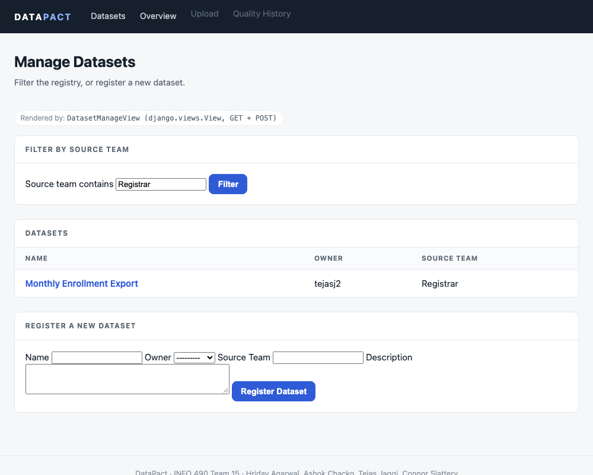
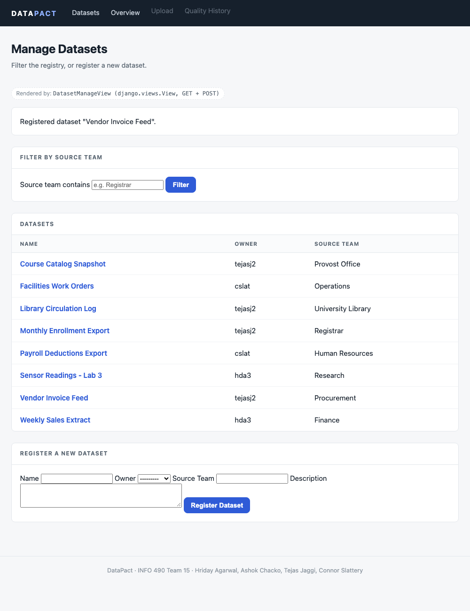
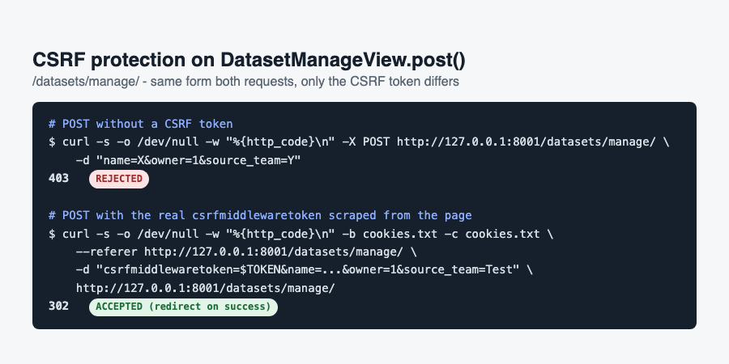
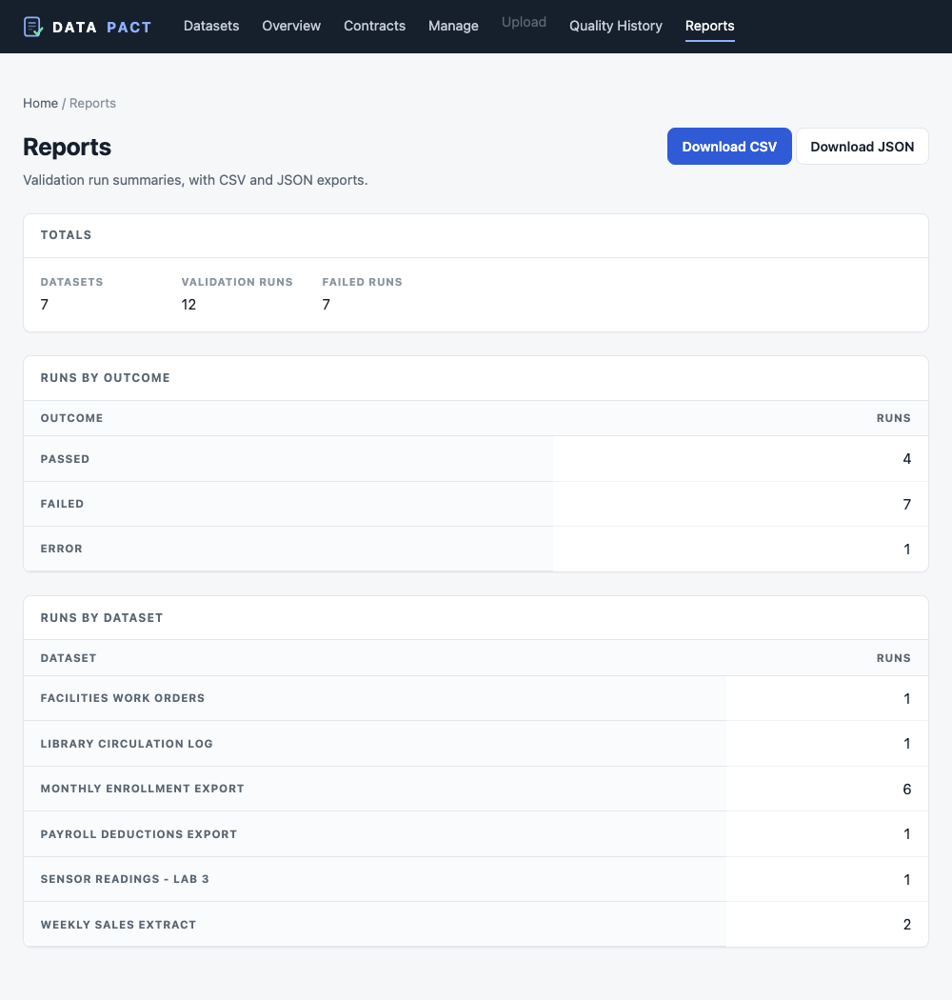
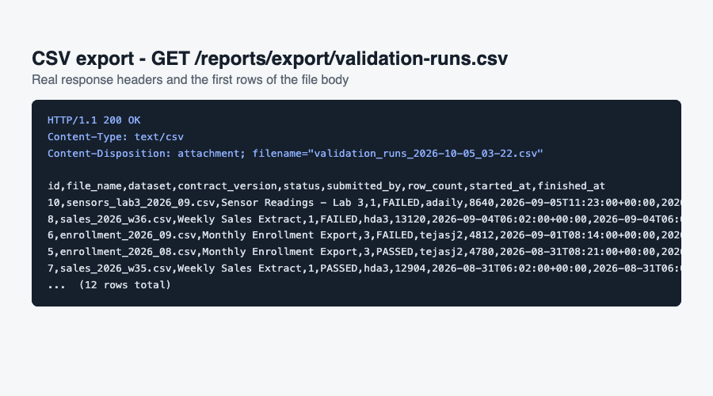
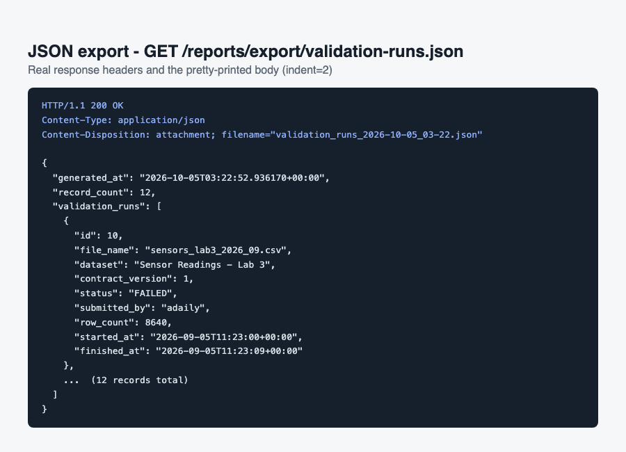

# DataPact

DataPact is a Django app that checks recurring data files against rules you define. You set the rules once, such as column types, allowed values, and null constraints. DataPact then checks every new file against them and points to the exact row and value that broke a rule, with a plain-English explanation.

INFO 490, Team 15, Fall 2026.

## Team

Hriday Agarwal, Ashok Chacko, Tejas Jaggi, Connor Slattery

## Where the project is

This repo holds the A1 data model and the A2 work so far.

- Done: the class-based views (Hriday), the HttpResponse view, `.gitignore`, `.env.example`, and the docs (Connor), the templates (Ashok), the split settings, the render() view, and the tests (Tejas).
- Still to come: later assignments build on this base.

## Setup

These steps are for Windows PowerShell. You need Python 3 and Git.

1. Clone the repo.

```
git clone https://github.com/S1attaro/15_DataPact.git
cd 15_DataPact
```

2. Create and activate a virtual environment.

```
python -m venv venv
venv\Scripts\Activate.ps1
```

If PowerShell blocks the script, run `Set-ExecutionPolicy -Scope Process Bypass` and try again.

3. Install the packages.

```
pip install -r requirements.txt
```

4. Make your own `.env` file.

```
Copy-Item .env.example .env
```

Fill in your own values. Do not commit `.env`. Git ignores it. Settings read `.env` on startup; without a `SECRET_KEY` every `manage.py` command stops with a message telling you to create the file.

5. The repo already includes `db.sqlite3` with demo data, so you can skip this step. To reset the database, run:

```
python manage.py migrate
python manage.py seed_demo
```

`seed_demo` clears the app tables before it loads the demo data.

## Environment variables

`.env.example` lists these. The values in it are placeholders.

| Name | Purpose |
| --- | --- |
| `SECRET_KEY` | Django secret key. Required. Make your own for `.env`. Production mode refuses keys that start with `django-insecure-`. |
| `ALLOWED_HOSTS` | Comma-separated hosts. Use `localhost,127.0.0.1` locally. |
| `API_KEY` | A dummy value for now. There is no external API yet. |
| `DATABASE_NAME` | Optional, development only. Set it to `db.local.sqlite3` to work against a throwaway database (ignored by Git) instead of the demo `db.sqlite3`. Run `python manage.py migrate` once after setting it. |

To make a new secret key:

```
python -c "from django.core.management.utils import get_random_secret_key as g; print(g())"
```

## Running

```
python manage.py runserver
```

Then open http://127.0.0.1:8000/datasets/.

`manage.py` uses the development settings (`DEBUG = True`). To run with the production settings (`DEBUG = False`, `ALLOWED_HOSTS` required):

```
python manage.py runserver --settings=datapact_project.settings.production
```

`wsgi.py` and `asgi.py` default to the production settings. `DJANGO_SETTINGS_MODULE` overrides either default.

Production mode serves static files through WhiteNoise, so collect them first:

```
python manage.py collectstatic --noinput --settings=datapact_project.settings.production
```

Skip that step and the pages still render, just without the content hash in the stylesheet URL. Development mode needs no collectstatic.

## Pages

| URL | View | Kind |
| --- | --- | --- |
| `/` | `home` | Function-based, render() |
| `/datasets/manual/` | `dataset_manual` | Function-based, HttpResponse |
| `/datasets/render/` | `dataset_render` | Function-based, render() |
| `/datasets/overview/` | `DatasetOverviewView` | Class-based, View |
| `/datasets/` | `DatasetListView` | Class-based, ListView |
| `/datasets/<id>/` | `DatasetDetailView` | Class-based, DetailView |
| `/contracts/search/` | `ContractSearchView` | Class-based, View (GET search + POST lookup) |
| `/datasets/manage/` | `DatasetManageView` | Class-based, View (GET filter + POST create) |
| `/quality/` | `quality_history` | Function-based, render() |
| `/quality/run-outcomes.png` | `run_outcomes_chart` | Function-based, PNG via HttpResponse |
| `/reports/` | `reports_view` | Function-based, render() |
| `/reports/export/validation-runs.csv` | `export_validation_runs_csv` | Function-based, CSV via HttpResponse |
| `/reports/export/validation-runs.json` | `export_validation_runs_json` | Function-based, JsonResponse |
| `/admin/` | Django admin | Built in |


## API

`/api/datasets/` returns the dataset registry as JSON (`JsonResponse`, `Content-Type: application/json`) instead of rendered HTML. Compare with `/datasets/manual/`, which returns the same underlying data as `HttpResponse` (`Content-Type: text/html`).

Optional filters via query parameters:
- `?owner=<username>` — datasets owned by that user
- `?source_team=<team>` — datasets from that source team (case-insensitive)

Example:
```
GET /api/datasets/?owner=cslat
```


## External API Integration (A4 Part 2)

/api/lookup/?q=<term> combines our internal Dataset registry with Open Library's public search API. Nothing from Open Library is stored; the external response is fetched, processed in memory, and returned alongside our own data.

Uses requests.get() with params=..., timeout=5, and .raise_for_status(). Handles timeouts and request failures with JSON error responses. Requires ?q=; returns a 400 error if missing.

Example: GET /api/lookup/?q=enrollment

Returns internal Dataset matches (name, description, or source_team containing the term) and up to 5 Open Library book results (title, author, first_publish_year) for the same term.


## Templates

Every page extends one base template, so the navigation, stylesheet, page
header and footer are written once.

```
data_quality/templates/data_quality/
  base.html                    site shell: <head>, CSS, top nav, page header, footer
  dataset_list.html            wireframe screen 1, the dataset registry
  dataset_detail.html          wireframe screen 2, one dataset and its contracts
  dataset_overview.html        contract coverage per dataset
  includes/
    _empty_state.html          the shared "nothing here yet" block
    _status_badge.html         the shared DRAFT / ACTIVE / RETIRED pill
```

Blocks a page can fill in: `title`, `extra_head`, `breadcrumbs`, `page_title`,
`page_subtitle`, `page_actions`, `content`.

`dataset_list.html` is written against a single context variable, `datasets`,
so it does not depend on which kind of view rendered it. Any view can reuse it:

```python
return render(request, "data_quality/dataset_list.html", {
    "datasets": Dataset.objects.select_related("owner"),
    "view_label": "Function-based view - render()",
})
```

`view_label` is optional. It fills the small caption under the page title that
names the view kind, and falls back to naming the `ListView` when it is absent.

Each list has an empty state written as ` ... `, not as a
separate `` check. `data_quality/tests.py` asserts on the empty-state
wording, so reword one and fix its test in the same commit.

The CSS is inline in `base.html` rather than in `static/` on purpose:
`runserver` stops serving static files once `DEBUG = False`, so an external
stylesheet would load in dev and 404 in prod. Inline CSS looks the same in both
modes with no `collectstatic` step.

## Static files and UI

The stylesheet and the logo are real static assets, served through Django's
staticfiles app in development and WhiteNoise in production.

```
data_quality/static/data_quality/
  css/datapact.css              the whole site stylesheet
  img/datapact-logo.svg         wordmark logo, also the favicon
```

They live at app level, namespaced under `data_quality/`, for the same reason
the templates are: the app owns them, so it keeps them, and nothing in
`settings` has to list a directory. `base.html` loads them with ``
and `` rather than a hard-coded `/static/...` path.

The CSS was inline in `base.html` until A3. It moved out for Section 3, which
meant fixing the reason it was inline: `runserver` serves no static files once
`DEBUG = False`. WhiteNoise now does, so the site looks the same in both modes.

**Cache busting.** In production, `collectstatic` renames each file to include
a hash of its contents — `datapact.css` becomes `datapact.e5ab6567e31e.css` —
and `` emits that name. The response carries
`Cache-Control: max-age=315360000, public, immutable`, so a browser can cache
it for ten years; editing the CSS changes the hash, so the next visitor
requests a different URL and sees the change immediately. There is no way to
serve a stale stylesheet and no need to ever clear a cache by hand.

A full request/response transcript of both modes is in
[`docs/a3_s3_static_evidence.txt`](docs/a3_s3_static_evidence.txt).

## Tests

```
python manage.py test data_quality
```

111 tests: the A2 class-based views, the templates, the render() view, the settings split, `ContractSearchView`, `DatasetManageView`, the static-file and cache-busting checks, the home page, navigation and Quality History chart, and the Reports page and CSV/JSON exports. Run them before you open a pull request.

## A3, Section 2 & Section 5 (Hriday)

### Section 2 - ORM Queries & Data Presentation (`/contracts/search/`)

| Rubric item | Evidence |
| --- | --- |
| Search (GET + POST) + filter works | GET search by dataset name/status, and a POST lookup on `Violation` |
| Relationship-spanning query | `dataset__name__icontains` (Contract → Dataset), `rule__contract__dataset__name__icontains` (Violation, two hops) |
| Aggregations (total + grouping) | total contract count, plus `values("status").annotate(total=Count("id"))` |
| Template clarity & `` | empty-state message when a search has no matches |

GET search filtered to one dataset (`?q=Enrollment`):



Same page after the POST violation lookup (aggregation panel + violation results):



Empty state when a search has no matches:



### Section 5 - Forms & User Input (`/datasets/manage/`)

| Rubric item | Evidence |
| --- | --- |
| GET form works | filters the dataset list by source team via `?team=...` |
| POST form works | registers a new `Dataset`, success message shown, Post/Redirect/Get |
| CSRF correctly implemented | POST without a token is rejected (403); with the real token it succeeds (302) |
| CBV adapted for input handling | one `DatasetManageView(View)` implements both `get()` and `post()` |

GET filter:



POST create (success message + new row):



CSRF enforcement:



## A3, Section 1 & Section 4 (Tejas)

### Section 1 - URL Linking & Navigation

The site now has a home page at `/`. It shows three counts (datasets,
validation runs, open violations) and links to every real section of the app.
The top navigation carries three working links - Datasets, Overview and
Quality History - and every link in the project is built with `` or
`get_absolute_url()`, so no template hard-codes a path.

Dataset detail pages are keyed by primary key (`/datasets/<int:pk>/`), and the
registry, overview, contract search and dataset manage pages all link to a
dataset through `{{ dataset.get_absolute_url }}` rather than rebuilding that
URL by hand. `Dataset.get_absolute_url()` is also what `DatasetManageView`
redirects to after a successful POST, so "where does a dataset live?" is
answered in exactly one place.

### Section 4 - Data Visualization (`/quality/`)

Quality History charts how DataPact's validation runs have turned out. The
numbers come from the ORM:

```python
ValidationRun.objects.values("status").annotate(total=Count("id"))
```

One `ValidationRun` is one file checked against one contract version, so the
chart counts runs, not rows. A status with no runs is kept at zero and the bar
order comes from the model rather than the database, so the axis stays stable.

The chart itself is drawn by Matplotlib in `data_quality/charts.py` on the
`Agg` backend, written to a `BytesIO` buffer and served straight from memory by
a Django view at `/quality/run-outcomes.png` with `content_type="image/png"` -
nothing is written to disk. Drawing goes through `Figure`/`FigureCanvasAgg`
rather than `pyplot`, because `pyplot`'s figure registry is process-wide and
Django answers requests on threads. With an empty database the endpoint still
returns a valid PNG that says so on its face. The page embeds the image through a reversed URL, gives it alt text
generated from the same numbers, and repeats those numbers in a table so they
are available without the image.

Screenshots: `docs/screenshots/a3/s1_home.png`, `s1_navigation.png`,
`s1_detail_via_link.png`, `s4_quality_history.png`, `s4_chart_endpoint.png`.

## A4, Part 3: Reports & Exports (Hriday)

Reports page at `/reports/`, built on `ValidationRun`.

| Rubric item | Evidence |
| --- | --- |
| CSV export | `export_validation_runs_csv` - `text/csv`, header row, timestamped filename |
| JSON export + metadata | `export_validation_runs_json` - `generated_at` + `record_count`, `json_dumps_params={"indent": 2}` |
| Two grouped summaries | runs by outcome (reuses `charts.run_outcome_counts()`), runs by dataset (`contract__dataset__name`, `annotate(total=Count("id"))`) |
| Totals line | dataset count, run count, failed-run count |
| Download buttons on the page | `page_actions` block links to both export URLs |

The two export views share one queryset helper
(`_validation_runs_queryset`), so the CSV and JSON can't drift out of sync
with each other.

Reports page:



CSV export (real response headers + body):



JSON export (real response headers + body):



## Project layout

```
15_DataPact/
  README.md
  manage.py
  requirements.txt
  .env.example          placeholder values, safe to commit
  .gitignore
  db.sqlite3            demo database
  datapact_project/     root URLs, wsgi, asgi
    settings/           base.py (shared), development.py, production.py
  data_quality/         models, views, urls, charts, forms, tests
    static/
      data_quality/     datapact.css, datapact-logo.svg
    templates/
      data_quality/     base.html, page templates, includes/ partials
  staticfiles/          collectstatic output (generated, git-ignored)
  docs/
    notes/              notes.txt, with weekly updates from each teammate
    wireframes/v1/      wireframes PDF
    branching_strategy/ how we use branches and pull requests
    screenshots/        A2, A3, and A4 browser screenshots
```

## Git workflow

- No one commits directly to `main`.
- Each task gets its own branch, named `name/task`, like `connor/env-example`.
- Every change reaches `main` through a pull request, merged with a merge commit.
- Pull `main` before you start a new branch.

More detail is in `docs/branching_strategy/branching_strategy.txt`.
